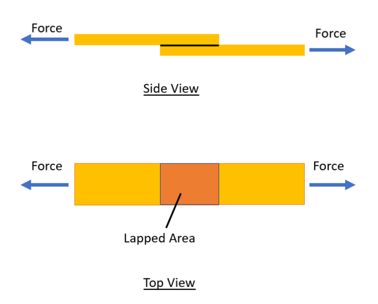

### Introduction

Many engineering components are subjected to forces that tend to make one part of the material slide relative to another. Such forces produce shear stresses within the material.

Examples include bolts, rivets, pins, welded joints, structural connections, and machine components. The ability of a material to resist these sliding forces is measured by conducting a shear test.

A shear test is performed to determine the shear strength of a material, which is defined as the maximum shear stress the material can withstand before failure.

### Physical Concept

When equal and opposite forces act parallel to a surface, the material experiences shear stress. The applied force tends to cause adjacent layers of the material to slide past one another.

In a direct shear test, the specimen is subjected to a load that produces shear across one or more planes until failure occurs.

<b>Figure 1. Lap Joint Subjected to Direct Shear Loading</b>

_Two overlapping plates are subjected to equal and opposite forces. The load transfer occurs through the lapped area, producing shear stress along the contact plane. When the applied shear stress exceeds the shear strength of the material, failure occurs by shearing along the loaded plane._

### Everyday Intuition

Shear action is commonly observed in everyday life.

Examples include:

- Cutting paper with scissors.
- Punching holes in metal sheets.
- Failure of bolts and rivets in structural connections.
- Sliding of joined components under load.

In each case, the applied force causes one portion of the material to move relative to another.

### Experimental Relevance

The shear test is used to determine the ability of a material to resist shear forces.

The test helps determine:

- Ultimate shear load
- Shear stress
- Shear strength
- Failure characteristics

These properties are important in the design of bolts, rivets, pins, keys, couplings, and structural connections.

### Single Shear and Double Shear

#### Single Shear

In single shear, failure occurs across one shear plane.

Examples:

- A single riveted connection
- A pin loaded across one section

#### Double Shear

In double shear, failure occurs across two shear planes simultaneously.

Examples:

- Double-riveted joints
- Pins loaded between two plates

For the same material and cross-sectional area, double shear can carry approximately twice the load of a comparable single shear arrangement.

### Apparatus and Working Principle

The experiment is performed using a Universal Testing Machine (UTM) equipped with a shear test fixture.

The setup generally consists of:

- Shear test fixture
- Loading arrangement
- Test specimen
- Load measuring system

The specimen is placed in the fixture and subjected to a gradually increasing load until shear failure occurs. The maximum load sustained before failure is recorded.

### Mathematical Formulation

#### Shear Stress

Shear stress is defined as the applied shear force divided by the resisting shear area.

$$
\tau=\frac{P}{A}
$$

where:

- $\tau$ = Shear stress (N/mm² or MPa)
- $P$ = Applied load (N)
- $A$ = Shear area (mm²)

#### Shear Area for Circular Specimens

For a specimen of diameter $d$:

$$
A=\frac{\pi d^2}{4}
$$

#### Shear Strength in Double Shear

For double shear, the resisting area becomes:

$$
A_{total}=2A
$$

Therefore,

$$
\tau=\frac{P}{2A}
$$

where:

- $P$ = Failure load
- $A$ = Cross-sectional area of one shear plane

### Failure of Materials in Shear

#### Ductile Materials

Examples:

- Mild steel
- Aluminium
- Copper

Characteristics:

- Undergo noticeable deformation before failure.
- Exhibit relatively large shear strain.

#### Brittle Materials

Examples:

- Cast iron
- Ceramics

Characteristics:

- Fail suddenly with little deformation.
- Exhibit lower shear ductility.

### Engineering Significance

Knowledge of shear strength is essential in engineering design.

The results of shear testing are used for:

- Design of bolts and rivets
- Design of pinned connections
- Structural steel connections
- Mechanical couplings and keys
- Fasteners and joining elements

Therefore, shear testing is an important method for evaluating the load-carrying capacity and safety of engineering components subjected to shear forces.
